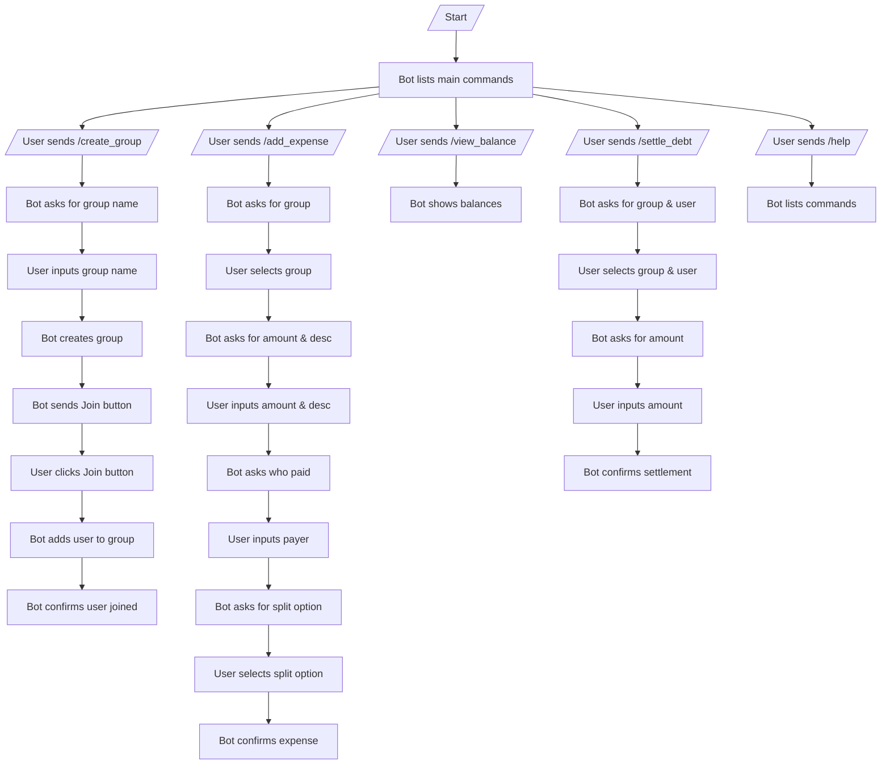
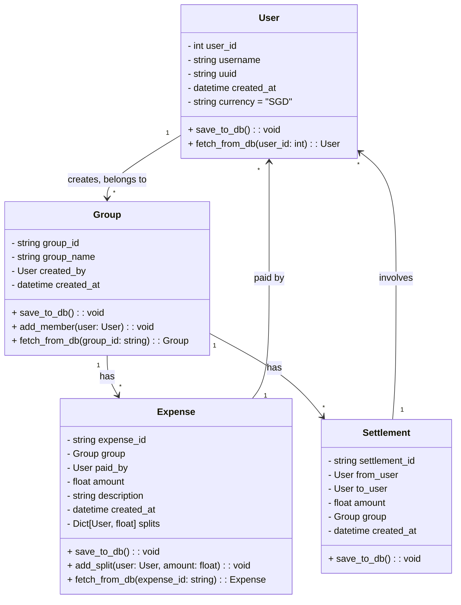

# Welcome to Coconutsplit

Coconutsplit is a Telegram bot built with [pyTelegramBotAPI](https://pytba.readthedocs.io/en/latest/).

## Directory Structure

```plaintext
/coconutsplit
│
├── /bot                     # Bot logic
│   ├── main.py              # Main bot script
│   ├── classes.py           # Class types
│   ├── handlers.py          # Custom message handlers
│
├── /web-app                 # Web app folder
│   ├── index.html           # Web app HTML
│   ├── style.css            # Styling
│   ├── script.js            # Web app logic
│
├── .env                     # Environment variables (bot token, etc.)
├── .gitignore               # Ignoring sensitive files (.env, .venv)
├── /venv                    # Virtual environment
│   └── ...
├── requirements.txt         # Python dependencies
├── client.py                # Setup Supabase client
├── Procfile                 # Logic for Heroku deployment
└── README.md                # Project documentation
```

## Database Schema

The following database schema outlines the structure used in Supabase to store user and expense data for the CoconutSplit bot.

### Users Table

Stores information about the users.

```sql
CREATE TABLE users (
    uuid UUID PRIMARY KEY,
    user_id BIGINT,
    username TEXT NOT NULL,
    created_at TIMESTAMP DEFAULT NOW(),
    currency TEXT DEFAULT 'SGD'
);
```

| Column      | Type      | Description                          |
| ----------- | --------- | ------------------------------------ |
| `uuid`      | UUID      | Unique identifier for the user        |
| `user_id`   | BIGINT    | Telegram ID of user                   |
| `username`  | TEXT      | The user's display name or username   |
| `created_at`| TIMESTAMP | The time when the user was created    |
| `currency`  | TEXT      | The user's preferred currency (optional) |

---

### Groups Table

Stores information about the groups users create.

```sql
CREATE TABLE groups (
    group_id UUID PRIMARY KEY GENERATED BY DEFAULT AS IDENTITY,
    group_name TEXT NOT NULL,
    created_by UUID REFERENCES users(uuid),
    created_at TIMESTAMP DEFAULT NOW()
     COLUMN chat_id BIGINT UNIQUE;
);
```

| Column       | Type      | Description                          |
| ------------ | --------- | ------------------------------------ |
| `group_id`   | UUID    | Unique identifier for the group      |
| `group_name` | TEXT      | The name of the group                |
| `created_by` | UUID      | UUID of the user who created the group |
| `created_at` | TIMESTAMP | The time when the group was created  |
| `chat_id` | BIGINT | Chat ID of the chat in which the group was created  |

---

### Group Members Table

Stores the relationship between users and groups.

```sql
CREATE TABLE group_members (
    group_id UUID REFERENCES groups(group_id),
    user_uuid UUID REFERENCES users(uuid),
    joined_at TIMESTAMP DEFAULT NOW(),
    PRIMARY KEY (group_id, user_id)
);
```

| Column      | Type      | Description                          |
| ----------- | --------- | ------------------------------------ |
| `group_id`  | UUID    | UUID of the group                      |
| `user_uuid`   | UUID    | UUID of the user                       |
| `joined_at` | TIMESTAMP | Time when the user joined the group  |

---

### Expenses Table

Stores information about the expenses created in each group.

```sql
CREATE TABLE expenses (
    expense_id UUID PRIMARY KEY GENERATED BY DEFAULT AS IDENTITY,
    group_id UUID REFERENCES groups(group_id),
    paid_by UUID REFERENCES users(uuid),
    amount DECIMAL(10, 2) NOT NULL,
    description TEXT,
    created_at TIMESTAMP DEFAULT NOW()
);
```

| Column       | Type      | Description                          |
| ------------ | --------- | ------------------------------------ |
| `expense_id` | UUID    | Unique identifier for the expense    |
| `group_id`   | UUID    | UUID of the group                      |
| `paid_by`    | UUID    | UUID of the user who paid              |
| `amount`     | DECIMAL   | Total amount of the expense          |
| `description`| TEXT      | Description of the expense           |
| `created_at` | TIMESTAMP | Time when the expense was created    |

---

### Expense Splits Table

Stores how expenses are split among group members.

```sql
CREATE TABLE expense_splits (
    expense_id UUID REFERENCES expenses(expense_id),
    user_uuid UUID REFERENCES users(uuid),
    amount_owed DECIMAL(10, 2),
    PRIMARY KEY (expense_id, user_id)
);
```

| Column        | Type      | Description                          |
| ------------- | --------- | ------------------------------------ |
| `expense_id`  | UUID    | UUID of the expense                    |
| `user_uuid`     | UUID    | UUID of the user who owes              |
| `amount_owed` | DECIMAL   | Amount owed by the user              |

---

### Settlements Table

Tracks payments made between users to settle debts.

```sql
CREATE TABLE settlements (
    settlement_id BIGINT PRIMARY KEY GENERATED BY DEFAULT AS IDENTITY,
    from_user UUID REFERENCES users(uuid),
    to_user UUID REFERENCES users(uuid),
    amount DECIMAL(10, 2),
    group_id BIGINT REFERENCES groups(group_id),
    created_at TIMESTAMP DEFAULT NOW()
);
```

| Column         | Type      | Description                          |
| -------------- | --------- | ------------------------------------ |
| `settlement_id`| UUID    | Unique identifier for the settlement |
| `from_user`    | UUID    | UUID of the payer                 |
| `to_user`      | UUID    | UUID of the recipient             |
| `amount`       | DECIMAL   | Amount settled                      |
| `group_id`     | UUID    | UUID of the group (optional)           |
| `created_at`   | TIMESTAMP | Time when the settlement was created |

## User Flow Chart


## UML Class Diagram

